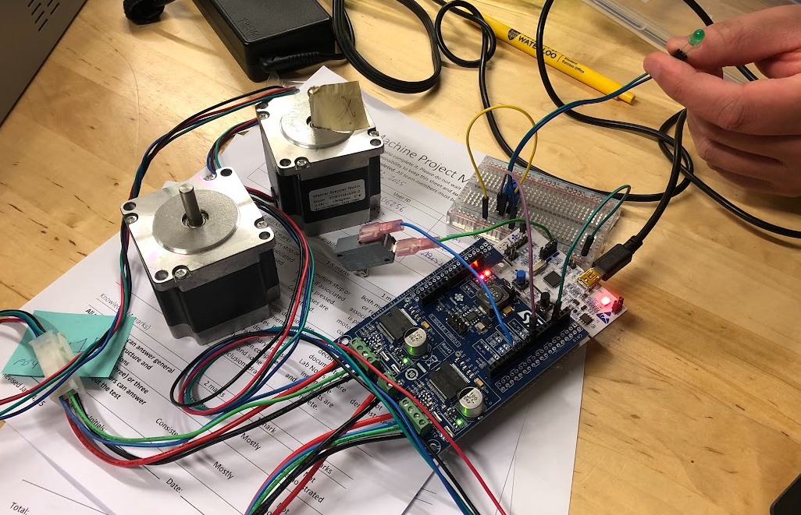

# Lab Notes

#### Brendan Chharawala, Owen Moogk, Nirmit Parikh

## Session 1

In this session, we're initializing our project with a new git repo, and following the configuration steps.

### Getting started
We connected the limit switch to PB4, and ground. Then, we configured it to be a pullup high, and outputted the result to serial. This way we could output the read value and verify that the circuit works.

Next, we used pin PC7 and ground, through a potentiometer, to light up and LED with a GPIO pin.

Lastly, we hooked up the motors and got the motors spinning based on the UART commands, or the demo. See below for documentation:

## Lab 2

### Tight Polling
The procedure used to find the maximum frequency was to increase the frequency until the result became unstable (to a point where it was frequently not turning on and off in time). The maximum frequency square wave that we were able to respond to using polling was 920 kHz. This response was reliable in almost every case, as seen below. However, there was a large amount of variation between the response times, which can also be seen in the yellow curves below.

We determined what a reliable response was by checking if the response consistently was able to toggle between on and off. Although there are some very odd edge cases (as can be seen by the ‘ghost’ lines above), it was consistently going to a “high” level, and then returning to a “low” therefore we decided this was acceptable. Increasing the frequency any higher did not allow for this, which is why we decided this was the maximum frequency.

The variation in response time was determined using cursors, measuring the response time of the quickest response, and subtracting it from the slowest response time. The difference in response times is 386 ns, which is likely the time of the while loop that is doing tight polling. This would be caused by the input going high at a different point in this loop, meaning the CPU has a different number of cycles to complete until it recognizes this change and can respond to it.

### Interrupts
The procedure to find the maximum frequency was similar to before, increasing the frequency until it was found that the response was no longer turning fully on and off. We determined what a reliable response was with the same criteria, such that almost every wave completes a full on-off cycle in a period. The maximum frequency was found to be 640 Hz. Although most of the time it completed much more quickly than this period, there were a few edge cases where it took much longer (which can be seen below).

The variation in the response time was found to be 240 ns. This is likely due to the context switching that is taking place, which may have varying times depending on where in the program the CPU is. Additionally, depending on what is in the registers, and how many registers are filled, will change how long the context switch takes.

### Results
Draw a schematic diagram of your system which includes the port and pin numbers of your input and output connections used for the exercises, as well as the oscilloscope connections. You do not need to include any other pins on the microcontroller or other unused components on the board/shield. Enough detail should be included for someone to connect the hardware required for the experiments without any additional information. You may hand draw the diagram as long as it is tidy and legible. To draw it electronically, you may find a tool such as Visio or SchemeIt (free) useful.

The technique that resulted in the lowest latency was tight polling. This makes sense as the context switch overhead caused by interrupts could be avoided, so there could be a smaller delay between the rising edge and the response.
The choice between polling and interrupts is often a matter of trade-offs. 

Polling, specifically tight polling, is beneficial for a few reasons. First, because of the simplicity of implementation (ie. just a while loop), there is less complexity and therefore it is less prone to errors caused by abstraction. Moreover, because the CPU cannot do anything else until the loop is finished polling, tight polling will be the fastest option in retrieving data.

Interrupts allow for the system to do other work while it's waiting for an interrupt, which frees up resources for completing other work. Moreover, multiple interrupts can be implemented which allow the system to listen for many inputs simultaneously, while also enforcing different levels of priorities.

Which synchronization technique do you think will be more appropriate for the limit switches on your two-axis machine? Justify your choice.

Interrupts would be more appropriate for the limit switches as high-priority interrupts will guarantee a response window which would be beneficial for safety while simultaneously guaranteeing that the system can do other work. Tight polling wouldn’t be an acceptable option, because other work would have to be done by the system while it needs to check the limit switches. However, if it did occasional polling it wouldn’t have the same time guarantee, which is an issue for a safety feature. Additionally, adding interrupts would allow the system to be expanded and developed in the future, with increasing scalability.

The latency between when the interrupt is triggered and when it is executed could result in the limit switches not functioning, or responding, as intended. This is critical when an immediate machine stop is required, as any delay in handling the interrupt could prevent the machine from stopping in time. This could be prevented by good system design and properly weighing tradeoffs when making design decisions.

## Lab 3: Limit Switch implementation

In this lab, we used machine number 9. We will continue to use this machine for the remainder of the term.

### Test cases:
- if the X switches are triggered the X motors should be capable or reversing or stopping
- if the Y switches are triggered the Y motors should be capable or reversing or stopping
- corner case: if the switches are both triggered at a corner the machine should reverse in both directions or stop
- The switches will have bounce, they should be debounced
- If the left and right (or top and bottom) are pressed at the same time, the machine should move in a direction that is safe to do so. (or stop)

### Implementation choices:
- The switches were chosen to be normally high and thus triggered on a falling edge with a pulldown resistor. We choose this because if the high lines on any of the switches break we want the system to recognize it is in an undefined state and thus stop as opposed to do nothing.
- For the interrupts we set separate handlers for each switch such that there is a faster response time given that everything has a dedicated handler

## Lab 4: ADC Implementation

### For next time
- Change away from PA0
- 
Setup debouncing

