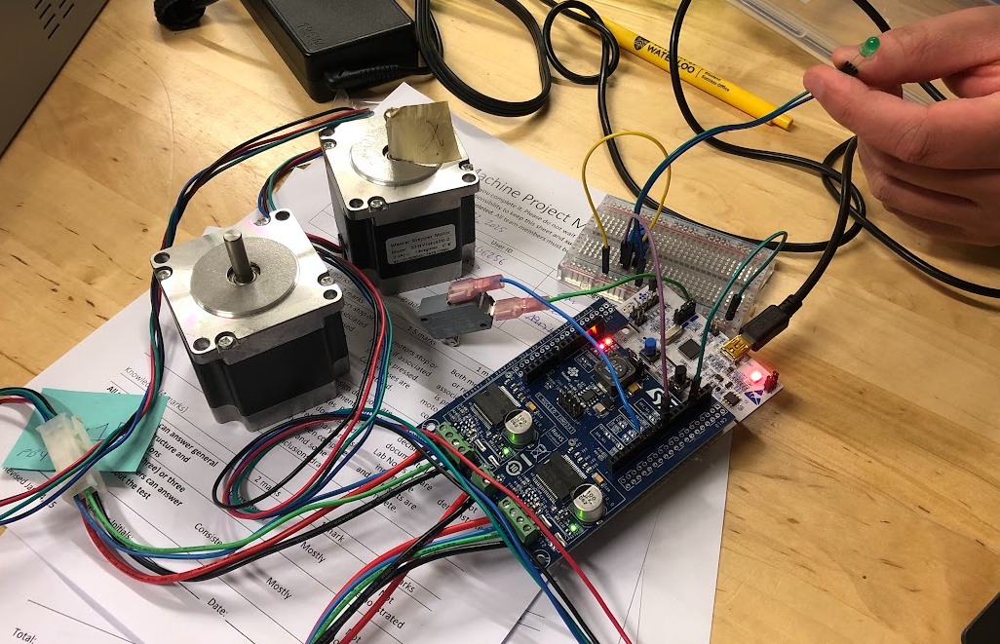
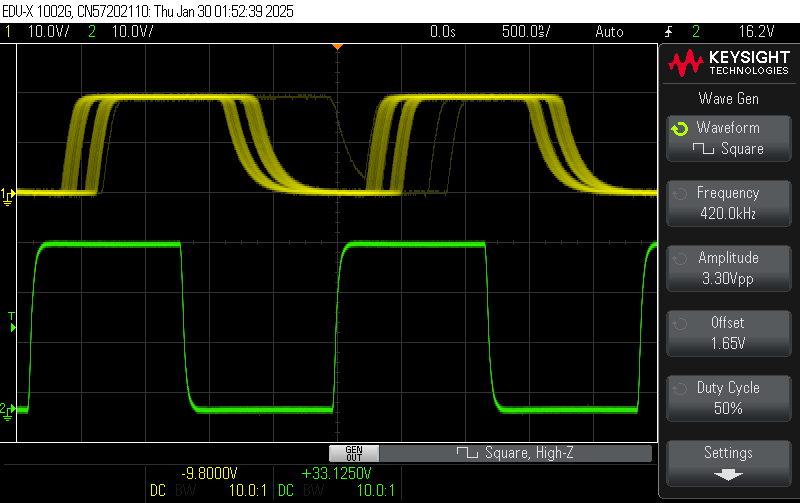
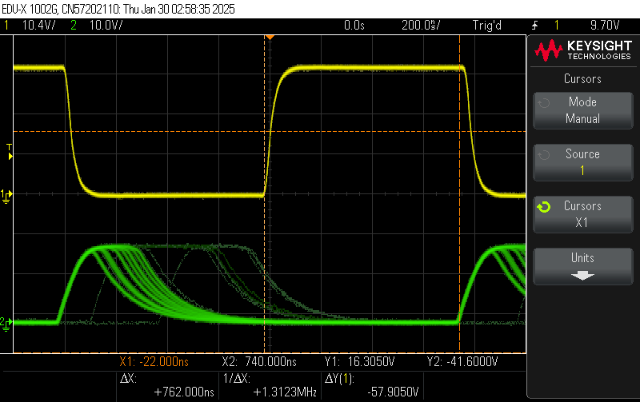
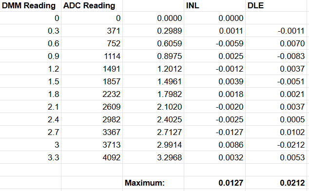
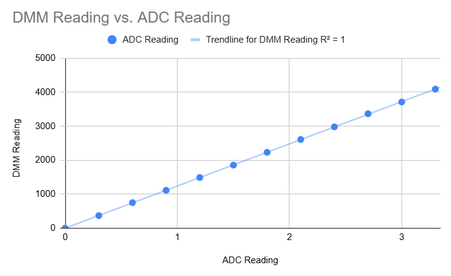
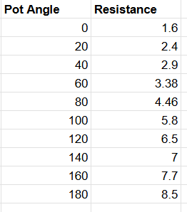
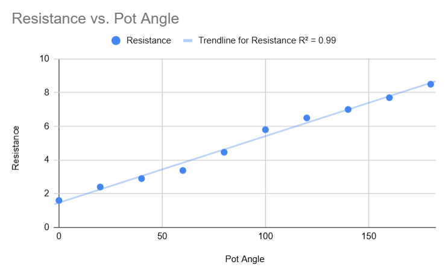

# Lab Notes

#### Brendan Chharawala, Owen Moogk, Nirmit Parikh
All group members contributed equally to all parts of this project

## Acknowledgments
- Stack Overflow served as an invaluable tool throughout this project specifically with debugging problems with the ADC. The advice and code examples from the forum helped with the groups understanding on conv mode discontinuous, scan mode, and other ADC setup parameters.
- We thank the course TAs (Jacob Kowalski, Rachel Du, and Xing Xing) for their help in debugging C code when we were at a loss for what was going wrong. Their help in clarifying instructions, and patience in answering our group's questions about the F401RE is appreciated.
- ChatGPT. Despite the group's initial assumptions, ChatGPT didn't turn out to be very helpful for this project. Aside from relatively trivial explanations of how a motor id function was called or why an if statement wasn't triggering, ChatGPT was only minimally used.
- Asa Littlejohn was a valuable peer to poll questions to during the project specifically when our group was having trouble getting the motors running. His insights helped us understand why the code we had written for our motors to run weren't running. 

## Session 1

In this session, we're initializing our project with a new git repo, and following the configuration steps.

### Getting started

We connected the limit switch to PB4, and ground. Then, we configured it to be a pullup high, and outputted the result to serial. This way we could output the read value and verify that the circuit works.

Next, we used pin PC7 and ground, through a potentiometer, to light up an LED with a GPIO pin.

Lastly, we hooked up the motors and got the motors spinning based on the UART commands, or the demo. See below for documentation:


## Lab 2

### Tight Polling

The procedure used to find the maximum frequency was to increase the frequency until the result became unstable (to a point where it was frequently not turning on and off in time). The maximum frequency square wave that we were able to respond to using polling was 920 kHz. This response was reliable in almost every case, as seen below. However, there was a large amount of variation between the response times, which can also be seen in the yellow curves below.


We determined what a reliable response was by checking if the response consistently was able to toggle between on and off. Although there are some very odd edge cases (as can be seen by the ‘ghost’ lines above), it was consistently going to a “high” level, and then returning to a “low” therefore we decided this was acceptable. Increasing the frequency any higher did not allow for this, which is why we decided this was the maximum frequency.

The variation in response time was determined using cursors, measuring the response time of the quickest response, and subtracting it from the slowest response time. The difference in response times is 386 ns, which is likely the time of the while loop that is doing tight polling. This would be caused by the input going high at a different point in this loop, meaning the CPU has a different number of cycles to complete until it recognizes this change and can respond to it.

### Interrupts

The procedure to find the maximum frequency was similar to before, increasing the frequency until it was found that the response was no longer turning fully on and off. We determined what a reliable response was with the same criteria, such that almost every wave completes a full on-off cycle in a period. The maximum frequency was found to be 640 Hz. Although most of the time it completed much more quickly than this period, there were a few edge cases where it took much longer (which can be seen below).


The variation in the response time was found to be 240 ns. This is likely due to the context switching that is taking place, which may have varying times depending on where in the program the CPU is. Additionally, depending on what is in the registers, and how many registers are filled, will change how long the context switch takes.

### Results

*Draw a schematic diagram of your system which includes the port and pin numbers of your input and output connections used for the exercises, as well as the oscilloscope connections. You do not need to include any other pins on the microcontroller or other unused components on the board/shield. Enough detail should be included for someone to connect the hardware required for the experiments without any additional information. You may hand draw the diagram as long as it is tidy and legible. To draw it electronically, you may find a tool such as Visio or SchemeIt (free) useful.*

The technique that resulted in the lowest latency was tight polling. This makes sense as the context switch overhead caused by interrupts could be avoided, so there could be a smaller delay between the rising edge and the response.
The choice between polling and interrupts is often a matter of trade-offs.

*Polling, specifically tight polling, is beneficial for a few reasons. First, because of the simplicity of implementation (ie. just a while loop), there is less complexity and therefore it is less prone to errors caused by abstraction. Moreover, because the CPU cannot do anything else until the loop is finished polling, tight polling will be the fastest option in retrieving data.*

Interrupts allow for the system to do other work while it's waiting for an interrupt, which frees up resources for completing other work. Moreover, multiple interrupts can be implemented which allow the system to listen for many inputs simultaneously, while also enforcing different levels of priorities.

*Which synchronization technique do you think will be more appropriate for the limit switches on your two-axis machine? Justify your choice.*

Interrupts would be more appropriate for the limit switches as high-priority interrupts will guarantee a response window which would be beneficial for safety while simultaneously guaranteeing that the system can do other work. Tight polling wouldn’t be an acceptable option, because other work would have to be done by the system while it needs to check the limit switches. However, if it did occasional polling it wouldn’t have the same time guarantee, which is an issue for a safety feature. Additionally, adding interrupts would allow the system to be expanded and developed in the future, with increasing scalability.

The latency between when the interrupt is triggered and when it is executed could result in the limit switches not functioning, or responding, as intended. This is critical when an immediate machine stop is required, as any delay in handling the interrupt could prevent the machine from stopping in time. This could be prevented by good system design and properly weighing tradeoffs when making design decisions.

## Lab 3: Limit Switch implementation

In this lab, we used machine number 9. We will continue to use this machine for the remainder of the term.

### Test cases:

- if the X switches are triggered the X motors should be capable or reversing or stopping
- if the Y switches are triggered the Y motors should be capable or reversing or stopping
- corner case: if the switches are both triggered at a corner the machine should reverse in both directions or stop
- The switches will have bounce, they should be debounced
- If the left and right (or top and bottom) are pressed at the same time, the machine should move in a direction that is safe to do so. (or stop)

### Implementation choices:

- The switches were chosen to be normally high and thus triggered on a falling edge with a pulldown resistor. We choose this because if the high lines on any of the switches break we want the system to recognize it is in an undefined state and thus stop as opposed to do nothing.
- For the interrupts we set separate handlers for each switch such that there is a faster response time given that everything has a dedicated handler

## Lab 4: ADC Implementation

In this lab, we first setup the debouncing that was required on the interrupts. To do this, we decided to go with the simplest approach with a one-shot timer. After waiting a set amount of time after the edge was detected, we would then read the value and make sure it was the value that we were expecting (in this case, low, after a falling edge). If this condition was true, then we would continue with the interrupt. Otherwise, we would clear the interrupt and continue.

We demo'd this, and then continued to the ADC implementation. We wired it up to pin PB0 using ADC1. Configuring this in code was a bit of a headache, especially since we forgot to call the configuration function (for ~1hr 😅). At the end of this lab we have the ADC configured to what we think is proper, however it's reading all zeros, so it will need to be worked on.

### For next time

- We're currently using PA0 for a limit switch interrupt, which will need to be changed as it's used for the motor drivers.
- Fix up the ADC!

## Lab 4.1: Working on the ADC

Between lab 4 and 5, we worked on the ADC. The main issue that we were facing with the ADC turned out to be an incorrectly selected channel, which was fixed. We also changed the settings of the ADC configuration to more accurately reflect the sampling and measurements that we wanted to take, which can be seen below:

```
  hadc1.Instance = ADC1;                                // Specifies that we're using ADC1 peripheral
  hadc1.Init.ClockPrescaler = ADC_CLOCK_SYNC_PCLK_DIV4; // ADC clock is peripheral clock (PCLK) divided by 4
  hadc1.Init.Resolution = ADC_RESOLUTION_12B;           // 12-bit resolution (0-4095 range)
  hadc1.Init.ScanConvMode = ENABLE;                     // ADC will convert multiple channels in a sequence
  hadc1.Init.ContinuousConvMode = DISABLE;              // ADC continuously converts without stopping
  hadc1.Init.DiscontinuousConvMode = DISABLE;           // Discontinuous mode off (not splitting conversions into subgroups)
  hadc1.Init.ExternalTrigConvEdge = ADC_SOFTWARE_START; // Using software start
  hadc1.Init.DataAlign = ADC_DATAALIGN_RIGHT;    // Data is right-aligned in the register
  hadc1.Init.NbrOfConversion = 2;                // Number of channels to convert in sequence (2 channels)
  hadc1.Init.DMAContinuousRequests = DISABLE;    // DMA not used for continuous requests
  hadc1.Init.EOCSelection = ADC_EOC_SINGLE_CONV; // End of Conversion flag set after each single conversion
```

In the next lab, we will work on characterizing the motor control, and ensuring that the readings are linear and the error is minimal (or accounted for).

## Lab 5: Completing ADC, starting Motor Control

We completed the ADC characterization, and completed the demo. Now we will implement motors. This worked fairly well, and we were able to get the motors moving at adequate speeds, and were able to control them well.

### ADC characterization

The ADC was characterized by reading the values that were put into it with a multimeter, and then reading the digital output from the ADC. Comparing these two, it was found that the ADC was extremely linear and gave accurate readings, which can be seen from the INL and DLE errors calculated:





### Potentiometer characterization

The potentiometer was characterized in a similar fashion, reading the input angles and the resistance measured. However, there may be some small error in the measurement of the potentiometer angle, due to a lack of proper measuring equipment. We made this measurement by aligning a protractor to the potentiometer, and then using a screwdriver mounted to a jack-knife to point to the approximate angle. We acknowledge that this is not an ideal or accurate testing setup, however approximate results were all that were needed. The following results were obtained:





### Motor characterization

The motors were controlled using velocity control, where the potentiometer position mapped to a velocity rather than a fixed position. This approach was chosen to avoid scenarios where the requested position might be outside the machine's physical limits... such as when the potentiometer is turned fully to one side.

However, this introduced a trade-off. We only updated the motor speed when the potentiometer position changed, allowing interrupts to adjust motor speed without being immediately overridden by user input. We also added a "zero" buffer zone in the center of the potentiometer range, ensuring the machine comes to a full stop when the control is near the middle. This makes it easier for users to stop the machine intentionally and avoids situations where the machine might appear stopped but is actually moving very slowly, which could pose a safety risk.

This was done through a few conditional statements, as shown below:

```
if (abs(adc_value - operating_adc_value) > MOTOR_CHANGE_THRESHOLD)
    {
      operating_adc_value = adc_values[0];

      if (abs(operating_adc_value - ZERO_SPEED_VALUE) < ZERO_SPEED_THRESHOLD)
      {
        L6470_HardStop(L6470_ID(1));
      }

      else
      {
        eL6470_DirId_t direction = 0;
        if ((operating_adc_value - ZERO_SPEED_VALUE) > 0)
        {
          direction = 1;
        }
        L6470_Run(L6470_ID(1), direction, abs((operating_adc_value - ZERO_SPEED_VALUE)) * Y_SPEED_MULTIPLIER);
      }
    }
```

### ADC Document Questions

*What is required to turn it on?*

This needed to be configured in code, using a configuration function. After the ADC configuration described above, it was initialized with the code below.

ADC_ChannelConfTypeDef channel8;
channel8.Channel = ADC_CHANNEL_8;
channel8.Rank = 1;
channel8.SamplingTime = ADC_SAMPLETIME_3CYCLES;
HAL_ADC_ConfigChannel(&hadc1, &channel8);

*What resolution did you choose? Why?*

We chose a 12 bit resolution. This was chosen because it provides more than enough resolution for our use case, and is relatively simple to work with. Going larger wouldn't bring any benefits, however going smaller may make the system feel clunky or discrete, which would not be a nice user experience.

*What conversion mode? Why?*

We are in single-shot conversion mode. This is because we don't really care what the output from the ADC is most of the time, and then we ask for the value each time we go through a while loop and get the value when requested. Although this was slightly slower than using a different mode where the ADC already has a value ready to send to the CPU, this small time difference doesn't matter for this application.

*What is your sampling time? Why?*

We used a sampling time of 3 ADC clock cycles due to the fact that our input signal is stable and in the time span of the ADC, non-transient. because of this a short sampling time is enough for accurate conversion. Longer sampling times would be needed if our signal wasn't a potentiometer and instead a signal with much higher noise.

*What happens when you change clock settings?*

In the lab, we asked the TA if this was necessary given that we were getting accurate results and they told us it was sufficient to not perform the experiment of changing clock settings but to instead mention what would happen. Changing the ADC clock settings would impact how quickly (or slowly) the ADC operates. Faster ADC means quicker conversions but if the sample isn't sampled long enough, could be inaccurate whereas a slower ADC could introduce an unnecessary bottleneck, for marginal gains in performance.

*How can you ensure your ADC is enabled and working?*

We were able to ensure that the ADC was enabled and working because a voltage applied at the ADC was able to be read into a variable in our code. We tested a range of input voltages and resistances (with a multimeter) and confirmed the ADC values changed accordingly and accurately. This showed the ADC was functioning expectedly.

*Ideally your ADC is linear. How accurate is it?*

It is very accurate. From the results above, the errors are very small, and using a line of best fit in excel it was found that it has an R-value of 1 (meaning perfectly linear). Low INL and DNL values further support that the ADC performed linearly and accurately.

*What is the error in your ADC?*

The INL and DLE are documented in the image above.

### POT Document Questions

*Does it behave linearly?*

Yes, it mostly behaves linearly. It can be seen above that it has an R-value of 0.99, meaning it's very close to linear. However, the non-linearity here can be chalked up to measurement error, as the accuracy of the potentiometer angle measurement wasn't great. Since the user will provide feedback into the system (ie. if the motor is moving too fast, the user will slow it down), small errors won't be a problem.

*How can you map the ADC readings to motor speed?*

This was discussed above.

## Lab 5.1: Reporting, Getting a Second Potentiometer Working

In this time between lab sessions, we spent some time reporting where we were, and getting the ADC working to read two different potentiometers at the same time. We did this by reconfiguring the ADC to read from a different channel each time we needed to read data. This is slow because we needed to reconfigure it each time, however was more than good enough.

During this lab we ran into several bugs that turned out to be because the wires we were using had poor connections along with the potentiometers not being seated properly. Moreover, we also accidentally conencted the wrong pins to the board from the potentiometer which resulted in some wasted time in trying to figure out why we couldn't get a reading from the potentiometer to the ADC.

## Lab 6: Final Lab

The final lab was used to get the system working holistically. We ran into issues with the pin selection, as the pin we had chosen for the second pot was used in the motor control, breaking our system. We had to re-configure this to get everything working as intended. After that, it was simple to complete the demos. Thanks for a fun term! 